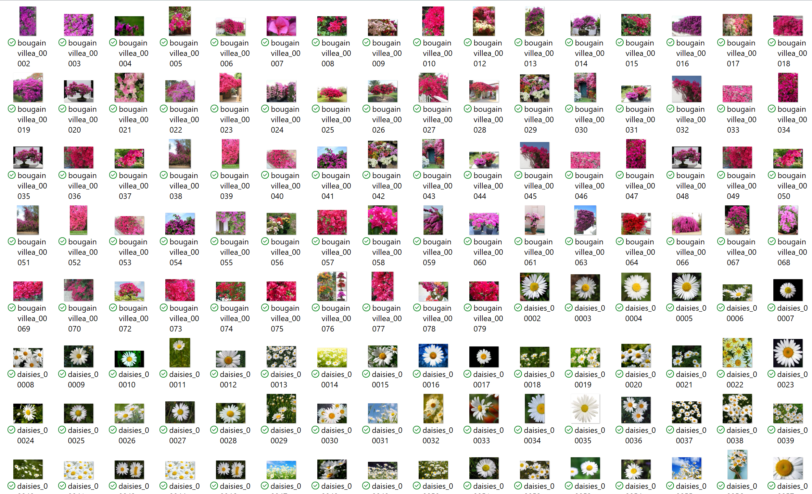
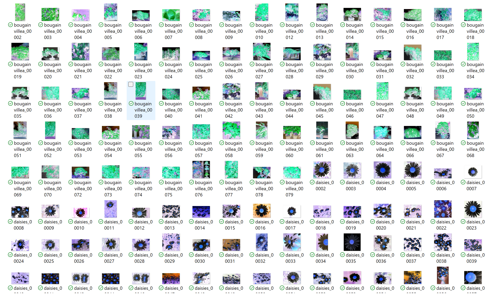
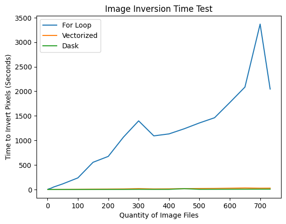
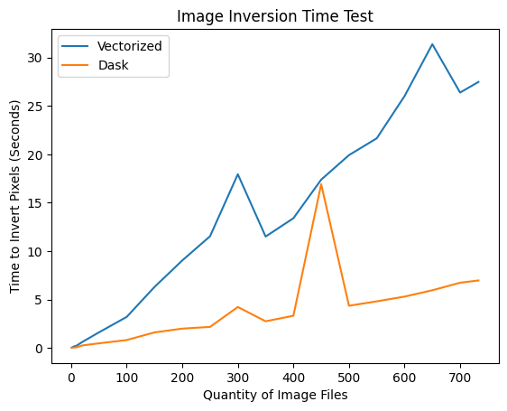

# image-inversion
## Motivation:
This project demonstrates the importance of vectorizing python operations, and investigates the additional benefits of multithreading such vectorized operations. Inverting the pixels of each image in a library of images is mathematically simple but can become slow if not implemented carefully. Assuming each image is treated independently, and the order of image processing does not matter, this task is a good candidate for multithreading with Dask because it is "embarassingly parallel". However, multithreading introduces some overhead, which, for small datasets, can actually slow things down. Here, I will perform pixel inversion using the following 3 methods:

1. Nested for loops
2. Vectorized calculations with Numpy
3. Multithreaded & vectorized calculations with Dask  

For each method, I will conduct time tests across different sample sizes, to understand the benefits of vectorization, and to find out when Dask's overhead becomes worth it. The same images are included in each sample across all 3 methods. For example, when the sample size is 100 images, the same 100 images are used to time the for loop method, the vectorized method, and the Dask method.

## Data:
I use the [kaggle flower image dataset](https://www.kaggle.com/datasets/aksha05/flower-image-dataset?resource=download), which includes 733 images of flowers. The images vary in size from 106,800 pixels to 24,000,000 pixels, with a median size of 1,048,576 pixels.  

Here is a sample of the original images:  
  

## Results:
All three methods successfully inverted and saved all images they were given. Here is a sample of the output:
  

As expected, the nested for loop method performed the worst by far:  
  

Looking only at the vectorized and Dask methods, the cost of the multithreading overhead was quickly outweighed by the benefits of multithreading:  
  

For full implementation details, see the notebook "image_inversion.ipynb" in this repository.